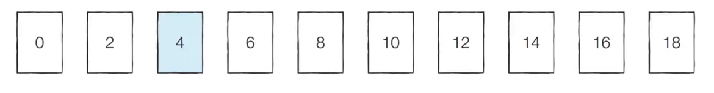
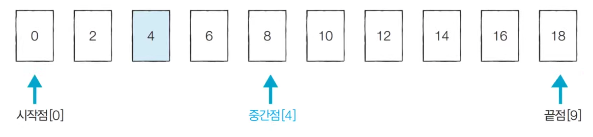
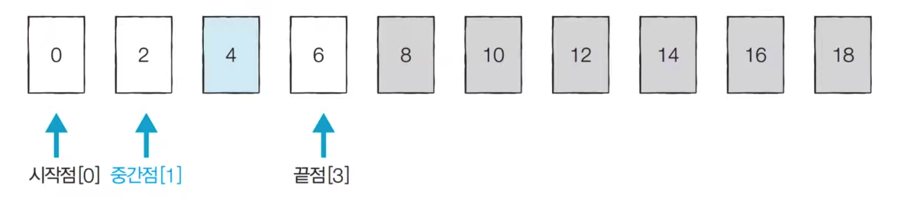
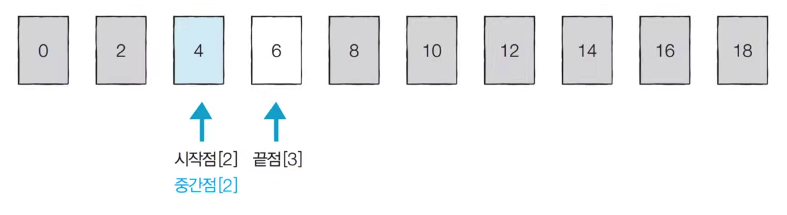

#  이진탐색이란?
데이터가 정렬이 기본이 된 배열에서 특정값을 찾아내는 알고리즘.   

# 방법
1. 배열의 중간에 있는 임의의 값을 선택하여 찾고자 하는 값 x와 비교한다.   
2. x가 중간값보다 작으면 중값 값을 기준으로 좌측의 데이터들을, x가중간값보다 크면 배열의 우측을 대상으로 다시 탐색한다.   

- 순차 탐색 : 리스트 안에 특정한 데이터를 찾기 위해 앞에서부터 하나씩 확인
- 이진 탐색 :   정렬되어있는 리스트에서 탐색범위를 절반씩 좁혀가며 데이터를 탐색

-> 이진탐색이 효율적이다!

# 예시

